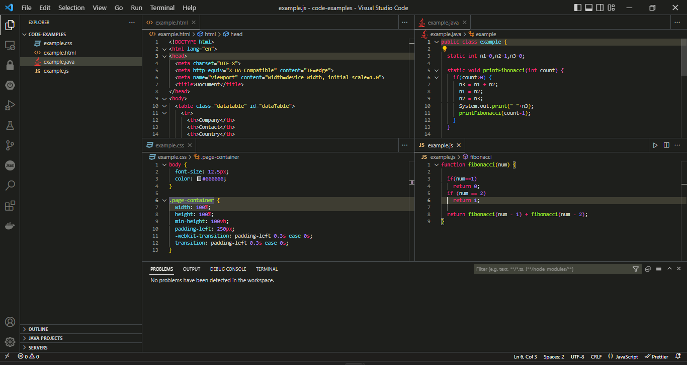

# Monokai Flat Fancy

Visual Studio Code theme based on Monokai but more flat and fancy.

Features:
- **Flat**: Workbench more flat.
- **Fancy**: Color theme more fancy.
- **Minimalistic**: Minimalist as you want.
- **Dark**: Darker than default Monokai theme.

## Install

- Open [VSCode Marketplace](https://marketplace.visualstudio.com/items?itemName=boenkkk.monokai-flat-fancy)
- Click install

## Usage

- Run the `Preferences: Color Theme` command.
- Select `Monokai Flat Fancy`

## Optional

- It works good with [VSCode Great Icons](https://marketplace.visualstudio.com/items?itemName=emmanuelbeziat.vscode-great-icons)

## Contributing

If you found a problem, or have a feature request, please open an [issue](https://github.com/boenkkk/monokai-flat-fancy/issues) about it.

## License

MIT © Budi Santoso

## For more information

* [Boenkkk Blog](https://blog.boenkkk.dev)
* [How to create vscode theme articles](https://code.visualstudio.com/api/working-with-extensions/publishing-extension)
* [How to create vscode theme videos](https://www.youtube.com/watch?v=QCqWzb-9Sy8)